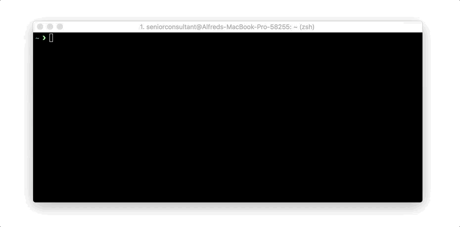

# USA VISA & Passport Tracker

This is a simple CommandLine tool to check the status of your VISA & Passport collection after its been approved by the US Embassy/Consulate.



## Installation

Add this line to your application's Gemfile:

```ruby
gem 'us_passport_tracker'
```

And then execute:

    $ bundle

Or install it yourself as:

    $ gem install us_passport_tracker

## Commandline Usage

Installing this gem gives you a nice commandline tool `us_passport_tracker` which you can use to quickly get your VISA status and continue with whatever you were doing.
This tool should work for all countries with a US Embassy/Consulate. Remember to use the full Country Name

```
us_passport_tracker PassportNumber ISOCountryCode
```

**Example (Status check via Ghana Embassy)**
```
us_passport_tracker G167290 GH
```

**Example (Status check via Nigeria Embassy)**

```
us_passport_tracker N167290 NG
```

## Application Usage

You can include this in your codebase by simply calling the method below

```ruby
passport_number = "G192028"
country_code = "GH"

tracker = USPassportTracker::Track.new(passport_number, country_code)
puts tracker.status
puts tracker.country_name

```

## Development

After checking out the repo, run `bin/setup` to install dependencies. Then, run `rake spec` to run the tests. You can also run `bin/console` for an interactive prompt that will allow you to experiment.

To install this gem onto your local machine, run `bundle exec rake install`. To release a new version, update the version number in `version.rb`, and then run `bundle exec rake release`, which will create a git tag for the version, push git commits and tags, and push the `.gem` file to [rubygems.org](https://rubygems.org).

## Contributing

Bug reports and pull requests are welcome on GitHub at https://github.com/nukturnal/us_passport_tracker. This project is intended to be a safe, welcoming space for collaboration, and contributors are expected to adhere to the [Contributor Covenant](http://contributor-covenant.org) code of conduct.

## License

The gem is available as open source under the terms of the [MIT License](https://opensource.org/licenses/MIT).

## Code of Conduct

Everyone interacting in the USPassportTracker project’s codebases, issue trackers, chat rooms and mailing lists is expected to follow the [code of conduct](https://github.com/[USERNAME]/us_passport_tracker/blob/master/CODE_OF_CONDUCT.md).
